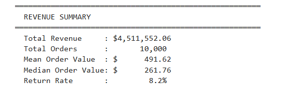
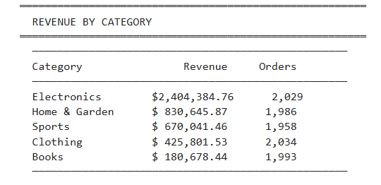
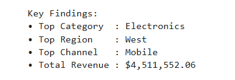

# E-commerce Sales Analysis

## Business Objective

Analyze e-commerce transactions to understand revenue drivers, customer behavior, channel performance, regional performance, returns, and discount patterns.

> **Data note:** The transaction dataset is synthetic and is used to demonstrate an end-to-end analytics workflow. Results must not be presented as real company performance.

## Key Questions

- Which product categories contribute the most revenue?
- How does revenue vary over time, region, and sales channel?
- Which channels and regions generate the most revenue?
- What is the return rate?
- How does discount level relate to order revenue?
- How frequently do customers purchase?

## Key Findings

- **10,000 orders** analyzed
- **$4.51M total revenue** in the supplied analysis output
- **8.23% return rate**
- **3,678 unique customers**
- **2.72 average orders per customer**
- Electronics represented **53.3% of revenue**
- Mobile was the highest-revenue channel
- West was the highest-revenue region

## Business Interpretation

The analysis converts transaction-level data into revenue, customer, channel, regional, and return KPIs that could support commercial decision-making. Because the dataset is synthetic, the findings demonstrate analytical technique rather than real business performance.

## Visuals







## Technical Workflow

1. Load and validate transaction data with Pandas
2. Parse dates and create analytical fields
3. Calculate revenue and order KPIs
4. Segment results by category, region, channel, customer, and discount
5. Generate summary tables and visualizations
6. Export reproducible results

## Tools

**Python · Pandas · Matplotlib · Jupyter Notebook**

## Project Structure

- `notebooks/ecommerce_sales_analysis.ipynb` — exploratory analysis
- `src/ecommerce_analysis.py` — reproducible analysis script
- `data/sales_data.xls` — source dataset
- `outputs/` — charts, CSV summaries, and JSON report

## How to Run

From `01-ecommerce-sales-analysis/`:

```bash
python src/ecommerce_analysis.py
```

Or open `notebooks/ecommerce_sales_analysis.ipynb` in Jupyter Notebook/JupyterLab.

## Skills Demonstrated

Exploratory data analysis, data preparation, KPI analysis, segmentation, trend analysis, customer analysis, return analysis, visualization, and reproducible reporting.
