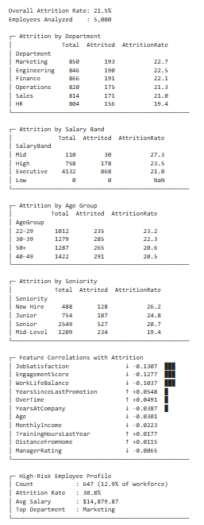

# HR Employee Attrition Analysis

## Business Objective

Analyze employee attrition patterns to understand where turnover is concentrated and how workforce characteristics relate to attrition.

> **Data note:** The dataset is synthetic and is used for portfolio practice. It is not a real company's employee dataset.

## Key Questions

- What is the overall attrition rate?
- Which departments show higher turnover?
- How does attrition vary across workforce segments?
- Which numeric variables have the strongest relationship with attrition?
- How should correlation findings be interpreted without overstating causation?

## Key Findings

- **5,000 employees** analyzed
- **21.52% overall attrition**
- A higher-risk segment contained **647 employees** with **30.8% attrition** in the original analysis
- Job satisfaction, engagement, and work-life balance showed negative relationships with attrition

## Visual

## Business Interpretation

The project demonstrates how HR data can be segmented into workforce KPIs and risk patterns. Correlation is used as an analytical signal, not evidence that a variable directly causes employee attrition.

## Technical Workflow

1. Validate the synthetic workforce dataset
2. Calculate workforce KPIs
3. Compare attrition across departments and segments
4. Calculate correlations for numeric variables
5. Visualize important relationships
6. Interpret results with correlation-vs-causation caveats

## Tools

**Python · Pandas · NumPy · Matplotlib · Jupyter Notebook**

## Project Structure

- `notebooks/hr_attrition_analysis.ipynb` — analysis notebook
- `data/hr_cleaned.xls` — cleaned dataset
- `outputs/hr_summary.json` — summary metrics
- `outputs/attrition_analysis.png` — analysis visualization

## How to Run

Open `notebooks/hr_attrition_analysis.ipynb` in Jupyter Notebook or JupyterLab and run the cells from top to bottom.

## Skills Demonstrated

Data preparation, KPI analysis, groupby analysis, workforce segmentation, correlation analysis, visualization, and responsible interpretation of analytical results.
