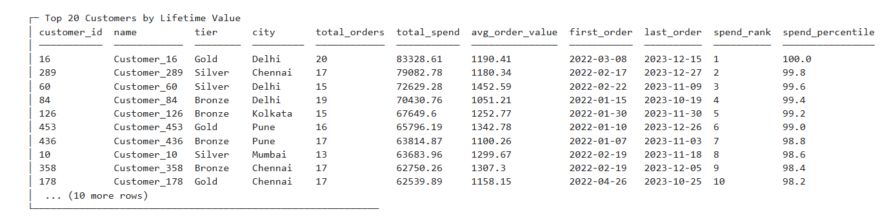

# Retail Business Intelligence — SQL Analysis

## Business Objective

Use SQL and Python to analyze retail revenue, customer value, product profitability, and growth across a multi-period dataset.

## Key Questions

- How does revenue change across categories and years?
- Which customers generate the highest lifetime value?
- Which products generate the strongest gross profit and margins?
- Which categories show growth or decline over time?

## Analysis Areas

- Revenue by category and year
- Year-over-year growth
- Customer lifetime value
- Average order value
- Product profitability
- Gross profit and margin analysis
- Channel completion and return rates

## SQL Techniques Demonstrated

**Joins · Aggregations · CTEs · Window Functions · LAG · RANK · CASE-style business logic · Date functions · KPI calculations**

### Example: Year-over-Year Growth

```sql
WITH yearly AS (
    SELECT p.category,
           strftime('%Y', o.order_date) AS year,
           SUM(i.quantity * i.unit_price * (1 - i.discount)) AS total_revenue
    FROM order_items i
    JOIN orders o ON i.order_id = o.order_id
    JOIN products p ON i.product_id = p.product_id
    WHERE o.status = 'Completed'
    GROUP BY p.category, year
)
SELECT category,
       year,
       ROUND(total_revenue, 2) AS total_revenue,
       ROUND((total_revenue - LAG(total_revenue) OVER (
           PARTITION BY category ORDER BY year
       )) * 100.0 / NULLIF(LAG(total_revenue) OVER (
           PARTITION BY category ORDER BY year
       ), 0), 1) AS yoy_growth_pct
FROM yearly;
```

This uses a **CTE + window function (`LAG`)** to turn yearly revenue into a growth KPI.

### Example: Customer Ranking

```sql
RANK() OVER (
    ORDER BY SUM(i.quantity * i.unit_price * (1 - i.discount)) DESC
) AS spend_rank
```

This ranks customers by completed-order spend and supports customer-value analysis.

### Example: Product Profitability

The profitability query combines product cost, selling price, quantity, and discount to calculate **revenue, COGS, gross profit, and margin percentage**.

## Business Interpretation

The project demonstrates how SQL can move beyond simple querying into KPI construction, customer analysis, profitability analysis, ranking, and trend reporting that supports commercial decision-making.

## Visual



## Technical Workflow

1. Query the SQLite database
2. Build reusable KPI queries
3. Use joins, aggregation, CTEs, and window functions
4. Analyze customer and product performance
5. Calculate growth and profitability metrics
6. Export results for reporting

## Tools

**SQL · SQLite · Python · Pandas · Jupyter Notebook**

## Project Structure

- `notebooks/retail_business_intelligence.ipynb` — analysis notebook
- `sql/retail_analysis.sql` — reusable SQL queries
- `data/retail_analytics.db` — SQLite database
- `outputs/sql_results.json` — generated analysis results
- `outputs/retail_business_intelligence.png` — visualization

## How to Run

Open `notebooks/retail_business_intelligence.ipynb` in Jupyter Notebook/JupyterLab. The included SQLite database supports reproducible SQL analysis.

## Skills Demonstrated

SQL querying, CTEs, window functions, joins, aggregation, business KPI analysis, customer segmentation, profitability analysis, ranking, and year-over-year analysis.
