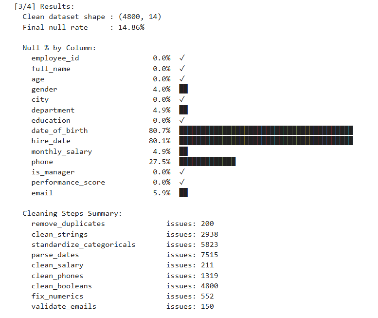

# Data Cleaning Pipeline

## Business Objective

Build an auditable data-cleaning workflow that identifies, validates, and corrects common data-quality issues before analysis.

## Data Quality Checks

The pipeline addresses:

- Duplicate records
- Inconsistent strings and categorical values
- Missing values
- Date parsing problems
- Salary formatting and imputation
- Invalid phone numbers
- Numeric inconsistencies
- Email validation

## Quality Results

The supplied cleaning report contains **5,000 source rows** reduced to **4,800 final rows**, with **200 duplicate rows removed**. The report records **14.86% overall null values** and separately tracks issues detected and fixes applied across the cleaning stages.

Examples from the audit report:

- **2,938** string issues detected and fixed
- **5,823** categorical-standardization issues detected and fixed
- **552** numeric issues detected and fixed
- **237** phone issues fixed; **1,082** invalid phones remained after validation
- **150** invalid emails were nulled rather than silently retained

Detection counts and fix counts are intentionally kept separate because not every detected issue was automatically repairable.

## Visual



## Business Interpretation

Reliable analytics depends on reliable inputs. This project demonstrates a repeatable approach to profiling, validating, cleaning, and documenting messy operational data before downstream analysis.

## Tools

**Python · Pandas · Jupyter Notebook**

## Project Structure

- `notebooks/data_cleaning_pipeline.ipynb` — cleaning workflow
- `src/data_cleaning_pipeline.py` — reusable cleaning script
- `data/employees_clean.xls` — cleaned dataset
- `outputs/cleaning_report.json` — data-quality audit report
- `outputs/data_quality_output.png` — output visualization

## How to Run

From `04-data-cleaning-pipeline/`:

```bash
python src/data_cleaning_pipeline.py
```

Or open `notebooks/data_cleaning_pipeline.ipynb` in Jupyter Notebook/JupyterLab.

## Skills Demonstrated

Data profiling, missing-value analysis, duplicate handling, categorical standardization, validation, imputation, transformation, and quality reporting.
