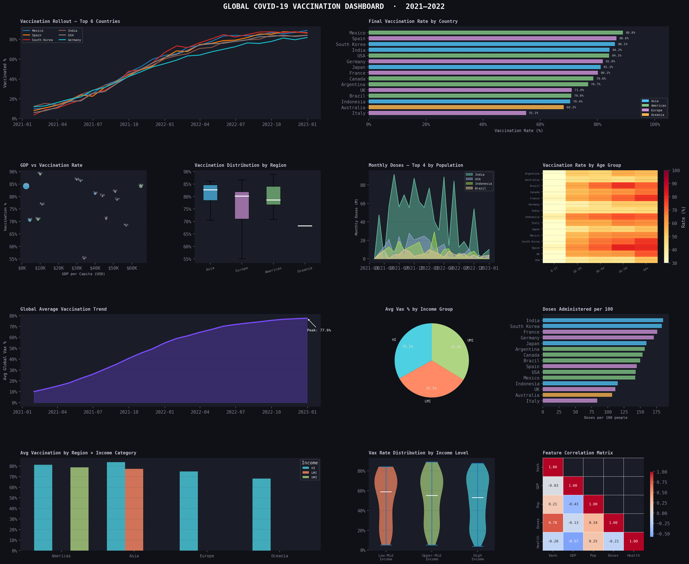
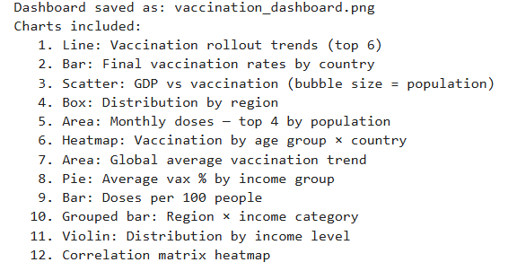

# Global Vaccination Dashboard

## Business Objective

Analyze a synthetic country-by-month vaccination dataset and communicate geographic and temporal patterns through KPI-focused visualizations.

> **Data note:** This project generates synthetic data for 10 countries across 12 monthly periods in 2021. It is a visualization and analytics demonstration, not a representation of real vaccination statistics.

## Dataset Scope

- **10 countries:** India, USA, Brazil, UK, Germany, France, Japan, Canada, Australia, Mexico
- **12 monthly observations per country**
- **120 country-month records** generated by the reusable Python script
- Measures include vaccination coverage percentage and population
- Monthly period: **January–December 2021**

## Analysis Questions

- How does average vaccination coverage change month to month?
- How do final coverage levels compare across countries?
- Which countries appear among the highest-coverage group in the generated dataset?
- How does population size relate to final vaccination coverage?

## Dashboard



## Additional Output



## Business Interpretation

The dashboard turns country-level time-series data into a compact reporting view containing a top-country rollout trend, final coverage comparison, population-versus-coverage relationship, and global average trend. Because the underlying data is synthetic, the patterns should be interpreted as examples of analytical storytelling rather than real-world public-health findings.

## Technical Workflow

1. Generate a reproducible synthetic country/month dataset with a fixed seed
2. Aggregate final coverage by country
3. Calculate the monthly global average trend
4. Compare population and final vaccination coverage
5. Produce a four-panel dashboard visualization
6. Export the dashboard as a PNG for reporting

## Tools

**Python · Pandas · NumPy · Matplotlib · Jupyter Notebook**

## Project Structure

- `notebooks/vaccination_analysis.ipynb` — analysis notebook
- `src/vaccination_analysis.py` — reusable analysis script
- `outputs/vaccination_dashboard.png` — dashboard output
- `outputs/vaccination_analysis_output.png` — analysis output

## How to Run

From `05-global-vaccination-dashboard/`:

```bash
python src/vaccination_analysis.py
```

Or open `notebooks/vaccination_analysis.ipynb` in Jupyter Notebook/JupyterLab.

## Limitations

The dataset is synthetic and generated from a mathematical rollout pattern. It should not be used for public-health conclusions, forecasting, policy decisions, or comparison with official vaccination statistics.

## Skills Demonstrated

Data generation, data preparation, aggregation, time-series analysis, comparative visualization, KPI reporting, dashboard communication, and analytical storytelling.
