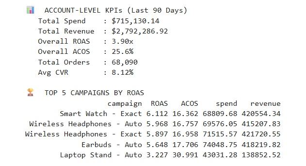

# Amazon PPC Analytics

## Business Objective

Analyze advertising performance to understand spend efficiency, campaign performance, keyword-type allocation, and weekly trends for better budget and targeting decisions.

## Interactive Dashboard

**[Open the interactive Amazon PPC dashboard](dashboard/amazon_ppc_dashboard.html)**

The dashboard presents spend, revenue, ROAS, ACOS, orders, CVR, weekly trends, spend allocation, campaign comparisons, and optimization opportunities in one browser-based view.



## Key Questions

- Which campaigns generate efficient revenue relative to spend?
- Which keyword types consume budget without comparable return?
- Where should budget be scaled, reduced, or monitored?
- How do ROAS, ACOS, CTR, CPC, and CVR change over time?

## Key Findings

- **Brand** keywords account for about **60% of revenue** while using about **39.7% of spend**.
- **Competitor** keywords use about **31.5% of spend** but contribute only about **17.3% of revenue**.
- Brand campaigns in the campaign-level dataset show ROAS around **5.9–6.1x**, while several competitor/broad campaigns are around **2.1–2.2x**.
- The dashboard also exposes campaign-level differences in CTR, CVR, ACOS and ROAS for deeper inspection.

These are descriptive observations from the supplied portfolio dataset, not causal conclusions.

## Business Interpretation

The project demonstrates how advertising data can be converted into efficiency KPIs and campaign-level insights that support budget allocation, bid management, and performance monitoring.

## Tools

**Python · Pandas · Matplotlib · Jupyter Notebook · HTML · JavaScript · Chart.js**

## KPI Definitions

- **CTR** = Clicks / Impressions
- **CPC** = Spend / Clicks
- **CVR** = Orders / Clicks
- **ACOS** = Spend / Revenue
- **ROAS** = Revenue / Spend
- **CPA** = Spend / Orders

## Project Structure

- `notebooks/amazon_ppc_analytics.ipynb` — analysis notebook
- `src/ppc_analysis.py` — reusable Python analysis helpers
- `data/` — campaign, spend-allocation and weekly-trend inputs
- `dashboard/amazon_ppc_dashboard.html` — interactive dashboard
- `outputs/amazon_ppc_analysis_output.png` — static analysis output

## How to Run

From `06-amazon-ppc-analytics/`:

```bash
python src/ppc_analysis.py
```

Open `dashboard/amazon_ppc_dashboard.html` directly in a browser for the interactive dashboard.

Or open `notebooks/amazon_ppc_analytics.ipynb` in Jupyter Notebook/JupyterLab.

> **Data note:** The campaign data is treated as a portfolio analysis dataset. No real customer-level personal data is used in the analysis.
